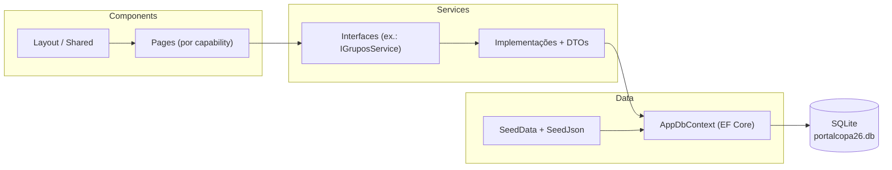
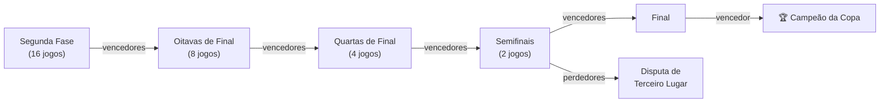

# PortalCopa26

Portal interativo da **Copa do Mundo FIFA 2026**, desenvolvido em **Blazor Web App (.NET 10)**. Apresenta os dados oficiais do torneio — seleções, grupos, jogos, ranking FIFA e o chaveamento eliminatório completo (Segunda Fase → Final) — com propagação automática de vencedores/perdedores, registro de resultados oficiais e um simulador interativo da fase de grupos.

> Projeto desenvolvido com **Spec-Driven Development** ([OpenSpec](https://github.com/Fission-AI/OpenSpec)): cada funcionalidade nasceu como uma *change* com proposta, especificação, design técnico e tarefas, disponíveis em [`openspec/`](./openspec).

---

## Sumário

- [Descrição do projeto](#descrição-do-projeto)
- [Objetivo do PortalCopa26](#objetivo-do-portalcopa26)
- [Tecnologias utilizadas](#tecnologias-utilizadas)
- [Arquitetura simplificada adotada](#arquitetura-simplificada-adotada)
- [Estrutura das pastas](#estrutura-das-pastas)
- [Funcionalidades implementadas](#funcionalidades-implementadas)
- [Fluxo do simulador da Copa](#fluxo-do-simulador-da-copa)
- [Regras de propagação do mata-mata](#regras-de-propagação-do-mata-mata)
- [Como executar o projeto](#como-executar-o-projeto)
- [Capturas de tela sugeridas](#capturas-de-tela-sugeridas)
- [Próximas evoluções](#próximas-evoluções)

---

## Descrição do projeto

O **PortalCopa26** é uma aplicação web que centraliza as informações da Copa do Mundo FIFA 2026 em um único portal: as 48 seleções classificadas, os 12 grupos, os 72 jogos da fase de grupos, o ranking FIFA, e as seis fases eliminatórias (Segunda Fase, Oitavas de Final, Quartas de Final, Semifinais, Disputa de Terceiro Lugar e Final), totalizando os 102 jogos oficiais do torneio.

Além de exibir os dados oficiais, o portal permite **registrar resultados** (fase de grupos e fases eliminatórias) e observar o chaveamento se atualizar automaticamente — vencedores e perdedores propagam para as fases seguintes sem que nenhum confronto precise ser recriado. Um **simulador** independente permite a qualquer visitante testar cenários hipotéticos da fase de grupos, sem jamais alterar os dados oficiais.

## Objetivo do PortalCopa26

- Oferecer uma visão única e sempre atualizada da fase de grupos e do chaveamento eliminatório da Copa do Mundo 2026.
- Permitir o registro dos resultados oficiais diretamente na interface, com recálculo automático de classificações e propagação automática no mata-mata.
- Dar ao visitante uma ferramenta de simulação pessoal e persistente da fase de grupos, totalmente isolada dos dados oficiais.
- Servir de base sólida e bem organizada para evoluções futuras (ver [Próximas evoluções](#próximas-evoluções)), sem comprometer a simplicidade da primeira versão.

## Tecnologias utilizadas

| Categoria | Tecnologia |
|---|---|
| Plataforma | [.NET 10](https://dotnet.microsoft.com/) |
| Framework web | ASP.NET Core **Blazor Web App** (render mode *Interactive Server*) |
| Linguagem | C# |
| Persistência | **Entity Framework Core 10** + **SQLite** (`Microsoft.EntityFrameworkCore.Sqlite`) |
| Interface | **Bootstrap 5** |
| Gráficos | **Chart.js**, integrado via **JSInterop** (`wwwroot/js/chartInterop.js`) |
| Dados de apoio | API pública da FIFA para bandeiras das seleções |
| Metodologia | **OpenSpec** (Spec-Driven Development) — proposta → especificação → design → tarefas por *change* |

## Arquitetura simplificada adotada

A aplicação é um **único projeto Blazor Web App**, organizado para permitir, no futuro, uma migração para arquitetura em camadas sem grandes reescritas — mas sem introduzir essa complexidade antes de ser necessária.



Regras arquiteturais aplicadas de forma consistente em todo o projeto:

- **Nenhuma página ou componente Razor acessa o `DbContext` diretamente** — todo acesso a dados passa por um serviço específico (`ILandingPageService`, `IGruposService`, `ISimuladorService`, `ISelecaoService`, `IRankingService`, `IJogosService`, `IFaseEliminatoriaService`, `IFinalCopaService`), injetado via DI nativa do ASP.NET Core.
- Cada *capability* (Grupos, Jogos, Ranking, Seleções, Simulador, Fase Eliminatória, Final) tem seus **próprios componentes, seu próprio serviço e seus próprios DTOs**, evitando acoplamento entre áreas do domínio.
- Componentes de apresentação (`.razor`) não contêm lógica de negócio — regras de classificação, desempate e propagação do mata-mata vivem em classes de serviço puras e testáveis (ex.: `ClassificacaoCalculator`, `JogoEliminatorioResolver`, `GrafoEliminatorioReader`).
- Lógica compartilhada entre fases eliminatórias (leitura do grafo de jogos, resolução de vencedor/perdedor) é extraída para classes reutilizadas por mais de um serviço, evitando duplicação.

## Estrutura das pastas

```text
prd/                                     # Raiz do repositório
├── docs/                                # Regras de negócio e estrutura de dados de referência
│   ├── RegrasCopa2026.md
│   └── EstruturaDados.md
├── fontes/                               # Dados oficiais do torneio (fonte da verdade dos seeds)
│   ├── copa2026_grupos.txt
│   ├── copa2026_jogos_primeira_fase.txt
│   ├── copa2026_jogos_*.txt              # Oitavas, Quartas, Semifinal, Terceiro Lugar, Final
│   ├── copa2026_ranking_fifa.txt
│   └── ...
├── openspec/                             # Spec-Driven Development (OpenSpec)
│   ├── specs/                            # Especificação vigente de cada capability
│   └── changes/archive/                  # Changes já implementadas e arquivadas
├── prototipo/                            # Protótipo estático (SPA) usado como referência visual
└── src/
    └── PortalCopa2026/
        ├── PortalCopa2026.slnx           # Solução (.slnx)
        └── PortalCopa2026/                # Projeto Blazor Web App
            ├── Components/
            │   ├── Layout/                # NavMenu, MainLayout, ReconnectModal
            │   ├── Pages/                 # Uma pasta por capability
            │   │   ├── LandingPage/       # Seções da Home (Hero, Estatísticas, Ranking, CTA...)
            │   │   ├── Grupos/
            │   │   ├── Jogos/
            │   │   ├── Ranking/
            │   │   ├── Selecoes/
            │   │   ├── Simulador/
            │   │   └── FaseEliminatoria/  # Card de jogo e painel do campeão, reaproveitados
            │   └── Shared/                # Componentes genéricos (ex.: ChartJs.razor)
            ├── Data/
            │   ├── AppDbContext.cs
            │   ├── SeedData.cs            # Seed idempotente, executado a cada start
            │   └── SeedJson/              # JSONs oficiais embutidos como recurso
            ├── Migrations/                # Migrations do EF Core
            ├── Models/
            │   ├── Copa/                  # Entidades oficiais (Selecao, Grupo, Jogo, Jogador, RankingFifa)
            │   └── Simulacao/             # Entidades da simulação do usuário (isoladas das oficiais)
            ├── Services/                  # Um serviço por capability (interface + implementação + Dtos)
            │   ├── Copa/                  # Lógica compartilhada (classificação, resolução do mata-mata)
            │   ├── FaseEliminatoria/
            │   ├── FinalCopa/
            │   ├── Grupos/
            │   ├── Jogos/
            │   ├── LandingPage/
            │   ├── Ranking/
            │   ├── Selecoes/
            │   └── Simulador/
            └── wwwroot/                   # CSS, JS (chartInterop.js) e libs (Bootstrap, Chart.js)
```

## Funcionalidades implementadas

| Página | Rota | Descrição |
|---|---|---|
| **Landing Page** | `/` | Visão geral do torneio: hero, estatísticas gerais, próximos jogos, gráfico de barras do ranking FIFA (Chart.js) e chamada para o simulador |
| **Jogos** | `/jogos` | Listagem completa dos 72 jogos da fase de grupos, agrupados por data e filtráveis por grupo |
| **Grupos** | `/grupos` | Os 12 grupos com classificação oficial calculada a partir dos resultados registrados; permite registrar/atualizar o placar oficial de cada jogo |
| **Simulador** | `/simulador` | Simulação pessoal e persistente da fase de grupos, com classificação, critérios de desempate e wildcards recalculados a cada palpite — nunca altera dados oficiais |
| **Seleções** | `/selecoes` | As 48 seleções classificadas, com busca por nome/grupo e detalhe (técnico, ranking FIFA, elenco convocado) |
| **Ranking** | `/ranking` | Ranking FIFA completo das seleções, com busca por nome |
| **Fase 2** | `/fase2` | 16 jogos oficiais da Segunda Fase |
| **Oitavas de Final** | `/oitavas` | 8 jogos, com mandante/visitante propagados automaticamente dos vencedores da Segunda Fase |
| **Quartas de Final** | `/quartas` | 4 jogos, propagados automaticamente das Oitavas |
| **Semifinais** | `/semifinais` | 2 jogos, propagados automaticamente das Quartas |
| **Final** | `/final` | Disputa de Terceiro Lugar (perdedores das Semifinais) + Final (vencedores das Semifinais) + painel de destaque do Campeão |

Funcionalidades transversais:

- Registro de placar do **tempo regulamentar** (já incluindo a prorrogação, quando houver) e, em caso de empate nas fases eliminatórias, de **pênaltis** — com rejeição de pênaltis também empatados.
- **Propagação automática** de vencedores e perdedores por todo o chaveamento, sem recriar nem duplicar jogos, com recálculo instantâneo ao alterar ou remover um resultado.
- **Simulação persistente**: os palpites do usuário sobrevivem a reinicializações da aplicação, armazenados separadamente dos dados oficiais.
- **Painel de destaque do Campeão**, exibido automaticamente quando a Final é decidida, com bandeira ampliada, fundo dourado, taça e quantidade de títulos mundiais históricos da seleção.
- Seed automático e idempotente: a aplicação já nasce populada com os dados oficiais do torneio, sem necessidade de scripts manuais.

## Fluxo do simulador da Copa

O simulador (`/simulador`) permite testar cenários da fase de grupos sem qualquer risco de alterar o torneio oficial:

1. Ao acessar a página, a aplicação recupera (ou cria) a **simulação** do usuário — uma única simulação por instância do banco, armazenada em tabelas próprias (`Simulacao` / `SimulacaoJogo`), completamente separadas da entidade `Jogo` oficial.
2. O usuário escolhe um grupo pelas abas e informa o placar de qualquer um dos jogos daquele grupo.
3. Cada palpite é salvo imediatamente em `SimulacaoJogo` — os campos `PlacarMandante`/`PlacarVisitante` do jogo **oficial** nunca são tocados.
4. A cada alteração, a classificação do grupo é recalculada do zero pelo `ClassificacaoCalculator`, aplicando a cascata oficial de critérios:
   1. Pontos (vitória = 3, empate = 1, derrota = 0)
   2. Saldo de gols
   3. Gols pró
   4. Confronto direto entre os times empatados (mini-tabela isolada)
   5. Ranking FIFA (seleção sem ranking cadastrado é tratada como pior posição possível)
   6. Código da seleção, em ordem alfabética, como critério absoluto final
5. Os **2 primeiros colocados** de cada grupo são marcados como classificados diretos. O **3º colocado** de cada um dos 12 grupos entra na disputa dos **melhores terceiros**, aplicando a mesma cascata de desempate (sem confronto direto, já que os terceiros vêm de grupos diferentes); os **8 melhores** são destacados como *wildcards*.
6. Um resumo mostra o total de jogos simulados em relação ao total de jogos da fase de grupos, além do ranking consolidado dos 12 terceiros colocados.
7. A simulação é **persistida no SQLite e restaurada automaticamente** na próxima visita, mesmo após reiniciar a aplicação.

> **Nota de escopo:** nesta versão, o chaveamento eliminatório (Segunda Fase em diante) utiliza os confrontos oficiais já definidos nos dados de origem (`fontes/`), e não é alimentado dinamicamente pela classificação da fase de grupos (oficial ou simulada). Ligar essa classificação à definição de quem avança à Segunda Fase é uma evolução natural — ver [Próximas evoluções](#próximas-evoluções).

## Regras de propagação do mata-mata

O chaveamento eliminatório (Segunda Fase → Oitavas → Quartas → Semifinais → Terceiro Lugar/Final) segue um modelo consistente em todas as fases:

- **Nenhum confronto guarda seleções fixas.** Cada jogo eliminatório referencia, via `JogoOrigemMandanteId`/`JogoOrigemVisitanteId`, os **jogos de origem** de onde vêm seus dois participantes — nunca os nomes das seleções diretamente.
- **Resolução em cadeia:** para descobrir quem joga em um confronto, o sistema resolve recursivamente o vencedor de cada jogo de origem, subindo pela cadeia até encontrar uma seleção fixa (fase de grupos) ou um jogo de origem ainda não decidido.
- **Critério de vitória:** um jogo eliminatório nunca termina empatado.
  1. Vence quem fez mais gols no placar oficial (que já inclui a prorrogação, quando houver).
  2. Em caso de empate no placar oficial, o sistema exige o placar de pênaltis para decidir o vencedor.
  3. Um placar de pênaltis também empatado é **rejeitado** — o jogo permanece sem vencedor até ser corrigido.
- **Placeholders até a definição:** enquanto um lado do confronto depende de um jogo de origem sem vencedor, a interface exibe um rótulo indicativo (`Vencedor <Fase> <N>`), sem atribuir seleção alguma; o registro de placar desse confronto fica bloqueado até que as duas seleções sejam conhecidas.
- **Disputa de Terceiro Lugar — a única exceção de propagação:** em vez do vencedor, esse jogo é alimentado pelo **perdedor** de cada Semifinal (`Perdedor Semifinal 1` × `Perdedor Semifinal 2`); a Final, no mesmo par de Semifinais, continua sendo alimentada pelos vencedores.
- **Recalculo automático e sem duplicação:** alterar ou remover o resultado de qualquer jogo eliminatório recalcula instantaneamente todas as fases seguintes que dependem dele — sem intervenção manual e **sem nunca recriar ou duplicar** um jogo já existente (o seed é idempotente por fase).
- **Campeão da Copa:** assim que a Final tem um vencedor definido, essa seleção é destacada como Campeã da Copa do Mundo FIFA 2026; alterar ou remover o resultado da Final recalcula (ou remove) esse destaque automaticamente.



## Como executar o projeto

### Pré-requisitos

- [.NET 10 SDK](https://dotnet.microsoft.com/download) instalado

### Passo a passo

```bash
# 1. Clonar o repositório
git clone https://github.com/leonardoti86/PortalCopa2026.git
cd PortalCopa2026

# 2. (Opcional) Restaurar dependências manualmente
dotnet restore src/PortalCopa2026/PortalCopa2026/PortalCopa2026.csproj

# 3. Executar a aplicação
dotnet run --project src/PortalCopa2026/PortalCopa2026/PortalCopa2026.csproj
```

Ao iniciar, a aplicação:

1. Aplica automaticamente as *migrations* do Entity Framework Core sobre o banco SQLite (`portalcopa26.db`).
2. Popula o banco com os dados oficiais do torneio, de forma **idempotente** — reiniciar a aplicação nunca duplica dados já existentes.

Não é necessário rodar `dotnet ef database update` manualmente.

Por padrão, a aplicação fica disponível em:

- **HTTP:** http://localhost:5163
- **HTTPS:** https://localhost:7130

Para abrir a solução inteira (`.slnx`) em vez de apenas o projeto:

```bash
cd src/PortalCopa2026
dotnet build   # ou dotnet run --project PortalCopa2026
```

## Capturas de tela sugeridas

> Sugestão de imagens a capturar e adicionar em `docs/img/` antes de publicar este README no GitHub (substitua os placeholders abaixo pelos arquivos reais).

| Página | Sugestão de captura |
|---|---|
| Landing Page (`/`) | Hero + seção de estatísticas + gráfico do ranking FIFA |
| Grupos (`/grupos`) | Tabela de classificação de um grupo com placares já registrados |
| Simulador (`/simulador`) | Abas de grupo com palpites informados + resumo de terceiros colocados |
| Seleções (`/selecoes`) | Listagem com busca + modal de detalhe de uma seleção |
| Fase eliminatória (ex.: `/semifinais`) | Confrontos com nomes/bandeiras propagados dos vencedores |
| Final (`/final`) | Terceiro Lugar + Final + painel de destaque do Campeão |

```markdown


```

## Próximas evoluções

- **Ligar a classificação da fase de grupos à Segunda Fase:** hoje os confrontos da Segunda Fase usam o chaveamento oficial fixo dos dados de origem; uma evolução natural é derivá-los dinamicamente da classificação oficial (2 primeiros + 8 melhores terceiros).
- **Critérios de desempate adicionais:** saldo de gols nos confrontos diretos e *fair play*, hoje fora do escopo da primeira versão (`docs/RegrasCopa2026.md`).
- **Testes automatizados:** a solução ainda não possui um projeto de testes dedicado.
- **Migração para arquitetura em camadas**, caso o projeto cresça além do que um único projeto Blazor comporta confortavelmente.
- **Área administrativa**, com autenticação, autorização e gestão de usuários — explicitamente fora do escopo da primeira versão.
- **Integração com APIs externas oficiais** para atualização automática de resultados, hoje inteiramente manual.
- **Cobertura de fotos oficiais dos estádios** para todos os jogos do torneio (hoje disponível apenas para o Terceiro Lugar e a Final).
